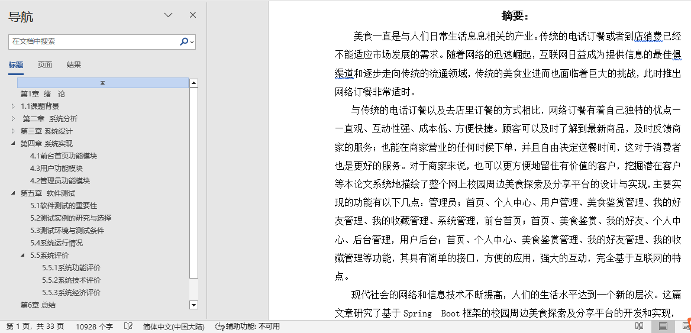
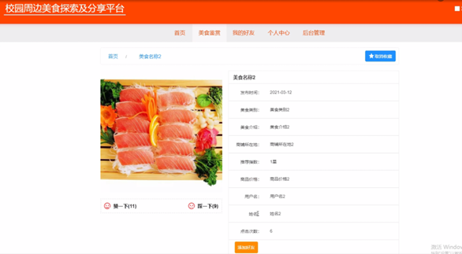
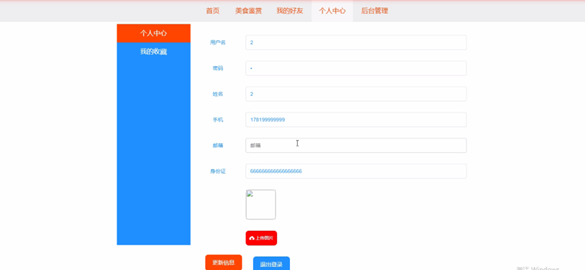
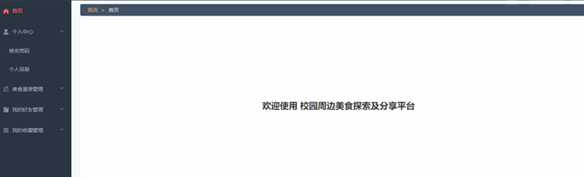
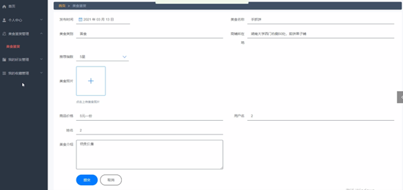
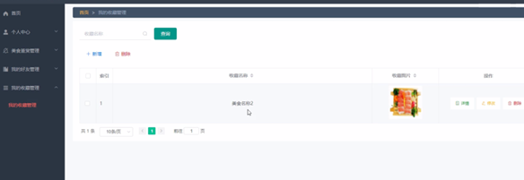
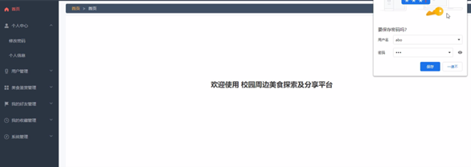
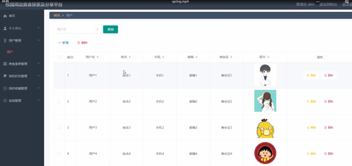
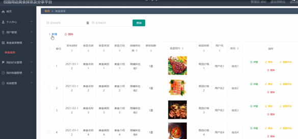

## 校园周边美食探索及分享平台(程序+报告)

- <b>完整代码获取地址：从戎源码网 ([https://armycodes.com/](https://armycodes.com/))</b>
- <b>技术探讨、资料分享，请加QQ群：692619798</b> 
- <b>作者微信：19941326836  QQ：952045282</b> 
- <b>承接计算机毕业设计、Java毕业设计、Python毕业设计、深度学习、机器学习</b>
- <b>选题+开题报告+任务书+程序定制+安装调试+论文+答辩ppt 一条龙服务</b>
- <b>所有选题地址 ([https://github.com/YuLin-Coder/AllProjectCatalog](https://github.com/YuLin-Coder/AllProjectCatalog)) </b>

## 项目介绍
校园周边美食探索及分享平台，系统包含两种角色：用户、管理员，系统分为前台和后台两大模块，主要功能如下：

前台首页功能模块
在校园周边美食探索及分享平台的系统首页，用户可以查看首页、美食鉴赏、我的好友、个人中心、后台管理等内容。

- 用户登录与注册  
  在用户注册页面，填写用户名、姓名、手机、邮箱、身份证等详细内容进行注册和登录。

- 美食鉴赏  
  在美食鉴赏页面查看发布时间、美食名称、美食类别、美食介绍、商品所在位置、推荐指数、美食照片、商品价格、用户名、姓名等信息，并进行点赞、评论，也可根据美食鉴赏名称进行搜索操作。

- 个人中心  
  在个人中心页面，填写用户名、姓名、手机、邮箱、身份证、照片等信息进行添加、修改、删除操作。

用户功能模块
用户登录后可以访问校园周边美食探索及分享平台的首页、个人中心、美食鉴赏管理、我的好友管理、我的收藏管理等内容。

- 个人中心  
  用户在个人信息页面中可以查看用户名、姓名、手机、邮箱、身份证、照片等信息，并根据需要进行查看、删除或其他操作。

- 美食鉴赏管理  
  用户可以添加发布时间、美食名称、美食类别、美食介绍、商品所在位置、推荐指数、美食照片、商品价格、用户名、姓名等信息，并进行修改或删除操作。

- 我的收藏管理  
  用户可以收藏美食名称、美食图片等，并进行查看或删除等操作。

管理员功能模块
管理员登录后，通过填写注册时输入的用户名、密码、角色进行登录。登录后可以查看首页、个人中心、用户管理、美食鉴赏管理、我的好友管理、我的收藏管理、系统管理等信息。

- 个人中心  
  管理员在个人中心可以修改密码，填写原密码、新密码、确认密码进行修改操作。

- 用户管理  
  在用户信息页面，管理员可以查看用户名、姓名、手机、邮箱、身份证、照片等信息，并对用户信息进行修改或删除操作。

- 美食鉴赏管理  
  在美食鉴赏信息页面，管理员可以查看发布时间、美食名称、美食类别、美食介绍、商品所在位置、推荐指数、美食照片、商品价格、用户名、姓名等信息，并对美食鉴赏信息进行新增、修改或删除操作。

- 我的好友管理  
  在我的好友页面，管理员可以查看用户名、姓名、添加时间等内容，并对好友进行新增、修改或删除操作。

- 系统管理  
  在系统管理页面，管理员可以查看轮播图，进行图片上传、添加、删除、修改操作，并对整个系统进行维护。

## 项目技术
- 编程语言：Java
- 数据库：MySQL
- 项目管理工具：Maven
- 前端技术：HTML、CSS、JavaScript、Vue
- 后端技术：Spring、SpringMVC、MyBatis

## 运行环境
- JDK版本：JDK1.8及以上
- 开发工具：IDEA、Ecplise、Myecplise都可以
- 数据库: MySQL5.7及以上
- Maven：maven3.0及以上
- Node：14.14.0及以上

## 运行截图

